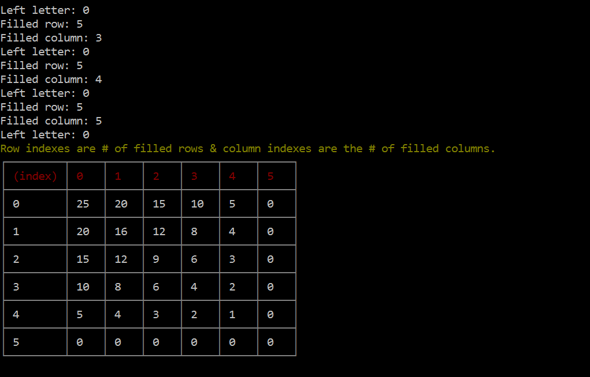

# crossword-means-end-analysis

Analyzes 5*5  New York Times crossword puzzle via means end analysis technique.
The left # letters in this puzzle according to filled rows/columns are printed.

**Note:** It is assumed that there are no black blocks.

### Setup & Usage
1. `npm install`
2. `npm start`

### Result

Have fun!
